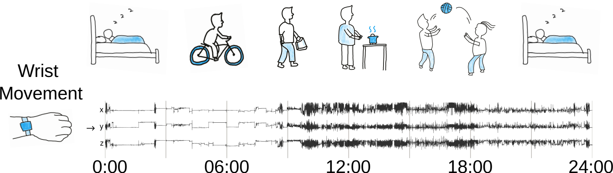

# Sensori

*Learning health from a day in motion.*

<a href="https://oxwearables.github.io/Sensori"></a>

----------------

Sensori is a self-supervised foundation model that learns general-purpose
representations of human health and disease directly from 24 hours of raw
tri-axial wrist movement.

This repository provides tools to:

- Pretrain Sensori on new, unlabelled accelerometer datasets.
- Extract day-level health representations using pretrained Sensori weights.
- Evaluate frozen representations on downstream health and activity tasks.

The preprocessing pipeline supports common wrist-accelerometer formats,
including CWA, GT3X, BIN and timestamped CSV files, with optional gzip
compression.

## Repository structure

| Path | Purpose |
| --- | --- |
| `src/` | Model architecture, data loaders, pretraining and embedding extraction |
| `config/` | Hydra model and pretraining configuration |
| `scripts/get_npy.py` | Raw-recording-to-NPY preprocessing |
| `tutorials/` | Executable human activity recognition (HAR) and NHANES notebooks |
| `docs/` | Project website and step-by-step tutorials |

## Installation

Sensori requires Python 3.13. Clone the repository, create an isolated
environment and install the package:

```bash
git clone https://github.com/OxWearables/Sensori.git
cd Sensori

conda create -n sensori python=3.13 pip
conda activate sensori
pip install -e .
```

- For a hardware-specific CPU or CUDA build, install PyTorch using the
[official selector](https://pytorch.org/get-started/locally/) before installing
Sensori.
- Reading and processing raw CWA, GT3X and BIN device files also requires
Java 8 or newer.

## Model weights and embedding extraction

By default, Sensori downloads the pretrained [model and
configuration](https://huggingface.co/light156/Sensori) to `checkpoint/` and
saves embeddings in `sensori_embeddings/`. Existing downloads are reused.

```bash
python -m sensori.inference --data-path /path/to/processed_participants
```

To use a local model instead, provide both its checkpoint and configuration:

```bash
python -m sensori.inference \
  --data-path /path/to/processed_participants \
  --checkpoint-path /path/to/model.pt \
  --config-path /path/to/config_model.yaml \
  --output-path /path/to/embeddings.npy
```

## Prepare input data

The released model expects finite `float32` XYZ acceleration in units of g,
sampled at 10 Hz. Each complete 24-hour array has shape `(2880, 300, 3)`:
2,880 consecutive 30-second windows, 300 samples per window and three axes.

Use the standalone preprocessing script to create the required participant/day
layout from one raw recording:

```bash
python scripts/get_npy.py \
  --file /path/to/participant_001.cwa \
  --output /path/to/processed_participants
```

The output has the following structure:

```text
processed_participants/
├── participant_001/
│   ├── day_0.npy
│   ├── day_1.npy
│   ├── info.json
│   └── wear_duration.csv
└── participant_002/
    └── ...
```

The script applies the preprocessing and quality-control contract used for the
released model: gravity calibration, 5 Hz low-pass filtering, resampling to
10 Hz, non-wear detection, complete finite calendar days, at least 22 hours of
wear, fewer than 10 interruptions and mean ENMO no greater than 200 mg. Exit
code `3` means that processing completed successfully but no day passed quality
control.

## Pretraining

Edit `config/config_train.yaml`, or override its values with Hydra from the
command line:

```bash
python -m sensori.train \
  train_data.data_path=/path/to/processed_participants \
  device_num=1
```

Command-line overrides take precedence over the YAML configuration. By default,
pretraining requires at least six eligible days per participant. See
`config/config_train.yaml` for all training options.

## Tutorials

Three runnable notebooks, each with a walkthrough on the [project website](https://oxwearables.github.io/Sensori):

| Notebook | What it does | Walkthrough |
| --- | --- | --- |
| [`nhanes_preprocessing.ipynb`](tutorials/nhanes_preprocessing.ipynb) | Downloads public NHANES wrist accelerometry data and writes model-ready daily arrays | [Convert raw accelerometry to NPY](https://oxwearables.github.io/Sensori/tutorials/raw-to-npy/) |
| [`har_evaluation.ipynb`](tutorials/har_evaluation.ipynb) | Evaluates minute-level representations on public HAR datasets | [Recognise activities minute by minute](https://oxwearables.github.io/Sensori/tutorials/minute-level-har/) |
| [`nhanes_evaluation.ipynb`](tutorials/nhanes_evaluation.ipynb) | Evaluates day-level representations on public NHANES health outcomes | [Probe health with day-level embeddings](https://oxwearables.github.io/Sensori/tutorials/day-level-health/) |

## Acknowledgements

We thank the participants of the UK Biobank, the China Kadoorie Biobank, the English
Longitudinal Study of Ageing and the National Health and Nutrition Examination
Survey, whose contributions made this research possible. We acknowledge support
from the Nuffield Department of Population Health, the Wellcome Trust and the
Pioneer Centre for SMARTbiomed.

## Citation

If you find this paper or code useful in your research, please consider citing
our [paper](https://arxiv.org/abs/2608.29494):

```bibtex
@misc{wang2026learning,
  title         = {Learning Human Health and Diseases from 24-hour Wrist Movement},
  author        = {Wang, Yong and McGagh, Dylan and Broomberg, Katya and Zhang, Zizheng and Carter, Jonathan and Naushad, Junayed and Brocklebank, Laura and Sun, Yang and Nicholson, George and Sun, Dianjianyi and Yu, Canqing and Lv, Jun and Barnard, Maxim and Lam, Hubert and Steptoe, Andrew and Eyre, David W. and Li, Liming and Chen, Zhengming and Wray, Naomi and Denaxas, Spiros and Collins, Gary S. and Du, Huaidong and Doherty, Aiden and Yuan, Hang},
  year          = {2026},
  eprint        = {2608.29494},
  archivePrefix = {arXiv},
  primaryClass  = {cs.LG},
  url           = {https://arxiv.org/abs/2608.29494}
}
```

## Licence

Sensori is available under the [Academic Use Licence](LICENSE.md), which permits
internal academic, non-commercial research subject to its conditions. For
commercial use, contact Oxford University Innovation as described in the
licence.
